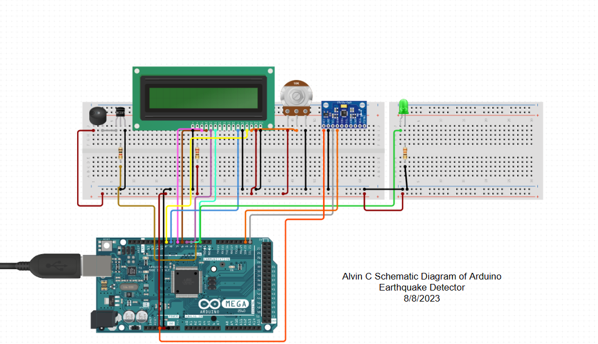

# Arduino Earthquake Detector and Alarm
For my project, I made a Arduino Earthquake detector using an accelerometer. My project is connected using wires, and it includes an Arduino Mega 2560 with an LCD, accelerometer, LED light, Buzzer, potentiometer, and a resistor. When the accelerometer detects motion, the LED and the buzzer both start blinking, indicating that there is an earthquake.

You should comment out all portions of your portfolio that you have not completed yet, as well as any instructions:
```HTML 
<!--- This is an HTML comment in Markdown -->
<!--- Anything between these symbols will not render on the published site -->
```

| Name | School | Area of Interest | Grade |
|:--:|:--:|:--:|:--:|
| Alvin C | Saratoga High School | Electrical Engineering | Incoming Junior

**Replace the BlueStamp logo below with an image of yourself and your completed project. Follow the guide [here](https://tomcam.github.io/least-github-pages/adding-images-github-pages-site.html) if you need help.**


  
# Final Milestone

**Don't forget to replace the text below with the embedding for your milestone video. Go to Youtube, click Share -> Embed, and copy and paste the code to replace what's below.**

<iframe width="560" height="315" src="https://www.youtube.com/embed/F7M7imOVGug" title="YouTube video player" frameborder="0" allow="accelerometer; autoplay; clipboard-write; encrypted-media; gyroscope; picture-in-picture; web-share" allowfullscreen></iframe>

For your final milestone, explain the outcome of your project. Key details to include are:
- What you've accomplished since your previous milestone
- What your biggest challenges and triumphs were at BSE
- A summary of key topics you learned about
- What you hope to learn in the future after everything you've learned at BSE


# Second Milestone
<iframe width="560" height="315" src="https://www.youtube.com/watch?v=cRGOkb_fa9w" title="YouTube video player" frameborder="0" allow="accelerometer; autoplay; clipboard-write; encrypted-media; gyroscope; picture-in-picture; web-share" allowfullscreen></iframe>

For my second milestone, I worked on the software components of my project. After checking that all my wires were connected properly, I installed Arduino and completed the software portion of my project. While I was working on my Arduino Code, one of the problems I noticed was that my accelerometer was not working, since the coordinates on my LCD were not changing when I moved my accelerometer around, which means that I will need to wait to get a new one. The rest of the software seems to be working, since all of the other parts were able to respond when I ran my code.

# First Milestone
<iframe width="560" height="315" src="https://youtu.be/GWjLR_b6VH0" title="YouTube video player" frameborder="0" allow="accelerometer; autoplay; clipboard-write; encrypted-media; gyroscope; picture-in-picture; web-share" allowfullscreen></iframe>

My first milestone was me setting up most of the hardware and making sure all of the parts were working when they were connected. Currently, my LCD, accelerometer, Arduino, LED, and buzzer all light up when the button is pressed. When I first connected all of my wires, my project parts were not turning on when I attatched the Arduino to the battery, so I had to reconnect all of my parts. When I connected all of my parts for a second time, I had to make sure that all of my parts were working as I was connecting the wires, since I did not want my entire circut to fail for a second time. My current design includes my Arduino, the accelerometer (the sensor), A buzzer (buzzes if earthquake is detected), a button, a LED Light, a resistor, a potentiometer, and a LCD display. When I worked on my second design, something I changed to make my design work better was attatching the accelerometer onto a second (smaller) breadboard in order for my accelerometer to not interfere with the connections of the other wires on my main breadboard.

# Schematics 



# Code
```
#include <Wire.h>
#include <LiquidCrystal.h>

#define MPU6050_ADDRESS 0x68

int16_t accelerometerX, accelerometerY, accelerometerZ;

// Initialize the library with the numbers of the interface pins
LiquidCrystal lcd(12, 11, 5, 4, 3, 2);

// Buzzer and LED pin definitions
const int ledPin = 8;        // Replace 9 with the desired digital pin for the LED
const int buzzerPin = 7;    // Replace 10 with the desired digital pin for the buzzer

// Threshold value for accelerometer readings
const int thresholdValue = 0;  // Set the threshold value here

void setup()
{
  Wire.begin();  // Initialize I2C communication
  lcd.begin(16, 2); // Initialize the LCD

  lcd.print("Accelerometer");
  lcd.setCursor(0, 1);
  lcd.print("Readings:");

  setupMPU6050();

  delay(100); // Delay to allow MPU6050 to stabilize
  lcd.clear();

  // Setup the LED and buzzer pins
  pinMode(ledPin, OUTPUT);
  pinMode(buzzerPin, OUTPUT);

  // Initialize the Serial communication for debugging
  Serial.begin(9600);
}

void loop()
{
  readAccelerometerData();
  displayAccelerometerData();
  printAccelerometerData();

  // Check if accelerometer values exceed the threshold
  if (abs(accelerometerX) > thresholdValue && abs(accelerometerY) > thresholdValue)
  {
    glowLEDAndBuzzer();
  }
  else
  {
    // If the threshold is not exceeded, turn off the LED and buzzer
    digitalWrite(ledPin, LOW);
    noTone(buzzerPin);
  }

  delay(500); // Adjust the delay as needed for the desired update rate
}

void setupMPU6050()
{
  Wire.beginTransmission(MPU6050_ADDRESS);
  Wire.write(0x6B);  // PWR_MGMT_1 register
  Wire.write(0);     // set to zero (wakes up the MPU6050)
  Wire.endTransmission(true);
}

void readAccelerometerData()
{
  Wire.beginTransmission(MPU6050_ADDRESS);
  Wire.write(0x3B);  // starting with register 0x3B (ACCEL_XOUT_H)
  Wire.endTransmission(false);
  Wire.requestFrom(MPU6050_ADDRESS, 6, true);  // request a total of 6 registers

  // read accelerometer data
  accelerometerX = Wire.read() << 8 | Wire.read();
  accelerometerY = Wire.read() << 8 | Wire.read();
  accelerometerZ = Wire.read() << 8 | Wire.read();
}

void displayAccelerometerData()
{
  lcd.setCursor(0, 0);
  lcd.print("X:");
  lcd.print(accelerometerX);
  lcd.print("     ");

  lcd.setCursor(0, 1);
  lcd.print("Y:");
  lcd.print(accelerometerY);
  lcd.print("     ");
}

void glowLEDAndBuzzer()
{
  // Blink the LED and sound the buzzer
  digitalWrite(ledPin, HIGH);
  tone(buzzerPin, 1000);  // You can adjust the frequency of the buzzer sound
  delay(100);             // Adjust the duration of the blinking and sound
  digitalWrite(ledPin, LOW);
  noTone(buzzerPin);
  delay(100);
}

void printAccelerometerData()
{
  Serial.print("Accelerometer X: ");
  Serial.print(accelerometerX);
  Serial.print("\t");

  Serial.print("Accelerometer Y: ");
  Serial.print(accelerometerY);
  Serial.print("\t");

  Serial.print("Accelerometer Z: ");
  Serial.println(accelerometerZ);
}
```

# Bill of Materials
Here's where you'll list the parts in your project. To add more rows, just copy and paste the example rows below.
Don't forget to place the link of where to buy each component inside the quotation marks in the corresponding row after href =. Follow the guide [here]([url](https://www.markdownguide.org/extended-syntax/)) to learn how to customize this to your project needs. 

Note: Several of the links provided may include multiple packages of a specific item.

| **Part** | **Note** | **Price** | **Link** |
|:--:|:--:|:--:|:--:|
|Arduino Mega 2560| Serves as the main 'platform' for computing tasks | $Price | https://www.amazon.com/ELEGOO-ATmega2560-ATMEGA16U2-Projects-Compliant/dp/B01H4ZLZLQ/ref=asc_df_B01H4ZLZLQ/?tag=hyprod-20&linkCode=df0&hvadid=309743296044&hvpos=&hvnetw=g&hvrand=17780797385688954248&hvpone=&hvptwo=&hvqmt=&hvdev=c&hvdvcmdl=&hvlocint=&hvlocphy=9032183&hvtargid=pla-490931309987&th=1 |
|Arduino GY-521 MPU-6050 Accelerometer|Used to track data and serves as the sensor | $10 | https://www.amazon.com/HiLetgo-MPU-6050-Accelerometer-Gyroscope-Converter/dp/B00LP25V1A/ref=asc_df_B00LP25V1A/?tag=hyprod-20&linkCode=df0&hvadid=247487538123&hvpos=&hvnetw=g&hvrand=2275097898170115433&hvpone=&hvptwo=&hvqmt=&hvdev=c&hvdvcmdl=&hvlocint=&hvlocphy=9032183&hvtargid=pla-407209664611&th=1 |
|Arduino LCD1602 Module|Displays the values | $Price | https://www.amazon.com/HiLetgo-Display-Backlight-Controller-Character/dp/B00HJ6AFW6/ref=asc_df_B00HJ6AFW6/?tag=hyprod-20&linkCode=df0&hvadid=312322349988&hvpos=&hvnetw=g&hvrand=11274295260367320723&hvpone=&hvptwo=&hvqmt=&hvdev=c&hvdvcmdl=&hvlocint=&hvlocphy=9032183&hvtargid=pla-585256965018&psc=1 |
|830 Tie Points Solderless Breadboard|Connects the wires/parts| $Price | https://www.amazon.com/BB830-Solderless-Plug-BreadBoard-tie-Points/dp/B0040Z4QN8/ref=asc_df_B0040Z4QN8/?tag=hyprod-20&linkCode=df0&hvadid=312400581241&hvpos=&hvnetw=g&hvrand=6119944691596849948&hvpone=&hvptwo=&hvqmt=&hvdev=c&hvdvcmdl=&hvlocint=&hvlocphy=9032183&hvtargid=pla-420088669616&psc=1 |
|Female-to-Male Dupont Wires|Connects the breadboard with the other pins| wfei | https://www.amazon.com/Elegoo-EL-CP-004-Multicolored-Breadboard-arduino/dp/B01EV70C78/ref=asc_df_B01EV70C78/?tag=hyprod-20&linkCode=df0&hvadid=222785939698&hvpos=&hvnetw=g&hvrand=571199392021448645&hvpone=&hvptwo=&hvqmt=&hvdev=c&hvdvcmdl=&hvlocint=&hvlocphy=9032183&hvtargid=pla-362913641420&psc=1 |
|Breadboard Jumper Wires|Connects points within a breadboard or from the breadboard to the Arduino| sdf | https://www.amazon.com/Solderless-Flexible-Breadboard-Jumper-100pcs/dp/B005TZJ0AM/ref=asc_df_B005TZJ0AM/?tag=hyprod-20&linkCode=df0&hvadid=193992629021&hvpos=&hvnetw=g&hvrand=5136654139456292485&hvpone=&hvptwo=&hvqmt=&hvdev=c&hvdvcmdl=&hvlocint=&hvlocphy=9032183&hvtargid=pla-312682288777&th=1 |
|Arduino Passive Buzzer|Generating Sound| wef | https://www.amazon.com/Passive-Terminals-Electronic-Continuous-Arduino/dp/B07D8MQ9ZW/ref=asc_df_B07D8MQ9ZW/?tag=hyprod-20&linkCode=df0&hvadid=416875836207&hvpos=&hvnetw=g&hvrand=3125219886403559333&hvpone=&hvptwo=&hvqmt=&hvdev=c&hvdvcmdl=&hvlocint=&hvlocphy=9061320&hvtargid=pla-906483836825&psc=1&tag=&ref=&adgrpid=100759323544&hvpone=&hvptwo=&hvadid=416875836207&hvpos=&hvnetw=g&hvrand=3125219886403559333&hvqmt=&hvdev=c&hvdvcmdl=&hvlocint=&hvlocphy=9061320&hvtargid=pla-906483836825 |
|LED Light|Generating Light| jef | https://www.amazon.com/eBoot-Pieces-Emitting-Diodes-Assorted/dp/B06XPV4CSH/ref=asc_df_B06XPV4CSH/?tag=hyprod-20&linkCode=df0&hvadid=167146990738&hvpos=&hvnetw=g&hvrand=2009498646297988445&hvpone=&hvptwo=&hvqmt=&hvdev=c&hvdvcmdl=&hvlocint=&hvlocphy=9032183&hvtargid=pla-369941417757&psc=1 |
|Potentiometer 10K| Adjusting the lighting of the LCD | jef | https://www.amazon.com/MCIGICM-Breadboard-Trim-Potentiometer-Arduino/dp/B07S69443J/ref=asc_df_B07S69443J/?tag=hyprod-20&linkCode=df0&hvadid=343482750668&hvpos=&hvnetw=g&hvrand=4595836891185817948&hvpone=&hvptwo=&hvqmt=&hvdev=c&hvdvcmdl=&hvlocint=&hvlocphy=9032183&hvtargid=pla-778270276725&psc=1&tag=&ref=&adgrpid=68626770865&hvpone=&hvptwo=&hvadid=343482750668&hvpos=&hvnetw=g&hvrand=4595836891185817948&hvqmt=&hvdev=c&hvdvcmdl=&hvlocint=&hvlocphy=9032183&hvtargid=pla-778270276725 |
|Resistor| Controls the flow of electrical current | dd | https://www.amazon.com/EDGELEC-Resistor-Tolerance-Multiple-Resistance/dp/B07QJB31M7/ref=asc_df_B07QJB31M7/?tag=hyprod-20&linkCode=df0&hvadid=344004970264&hvpos=&hvnetw=g&hvrand=1816867011051762237&hvpone=&hvptwo=&hvqmt=&hvdev=c&hvdvcmdl=&hvlocint=&hvlocphy=9032183&hvtargid=pla-784074045720&psc=1&tag=&ref=&adgrpid=70729706353&hvpone=&hvptwo=&hvadid=344004970264&hvpos=&hvnetw=g&hvrand=1816867011051762237&hvqmt=&hvdev=c&hvdvcmdl=&hvlocint=&hvlocphy=9032183&hvtargid=pla-784074045720 |

# Other Resources/Examples
One of the best parts about Github is that you can view how other people set up their own work. Here are some past BSE portfolios that are awesome examples. You can view how they set up their portfolio, and you can view their index.md files to understand how they implemented different portfolio components.
- [Example 1](https://trashytuber.github.io/YimingJiaBlueStamp/)
- [Example 2](https://sviatil0.github.io/Sviatoslav_BSE/)
- [Example 3](https://arneshkumar.github.io/arneshbluestamp/)

To watch the BSE tutorial on how to create a portfolio, click here.
